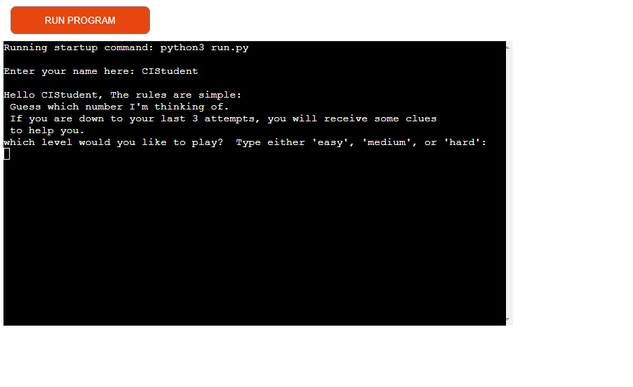
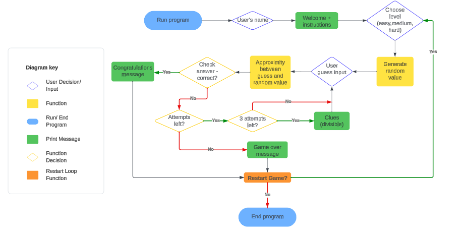
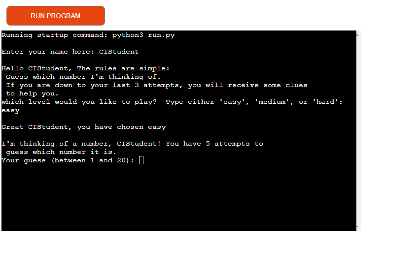
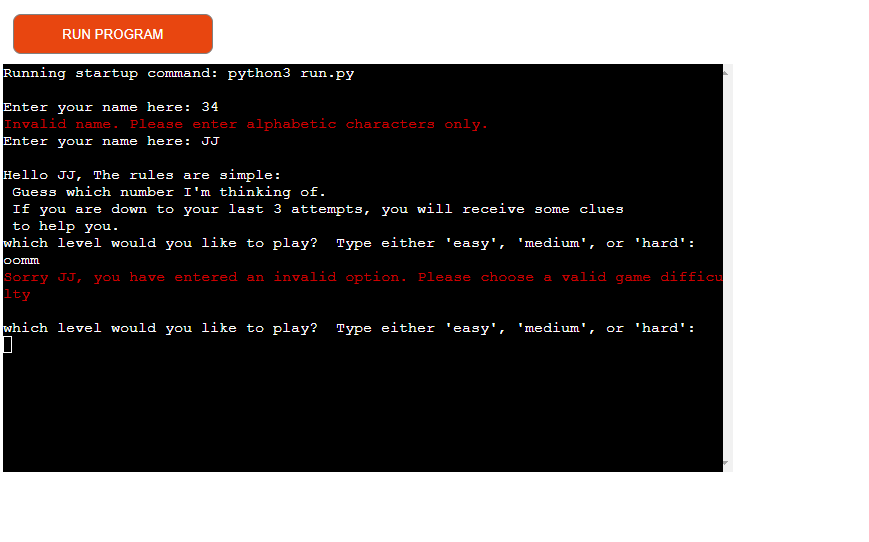
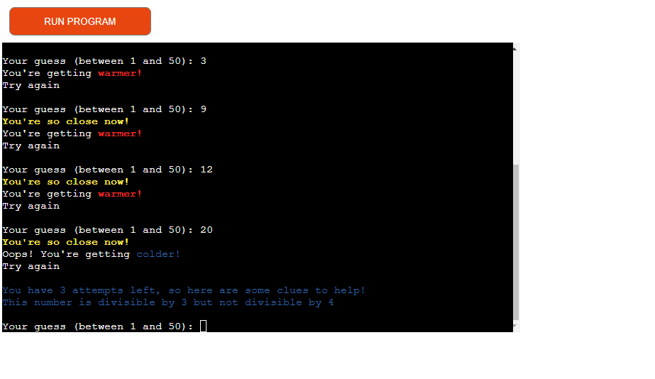
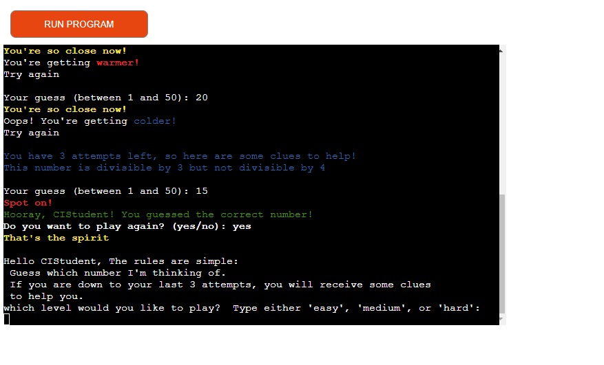
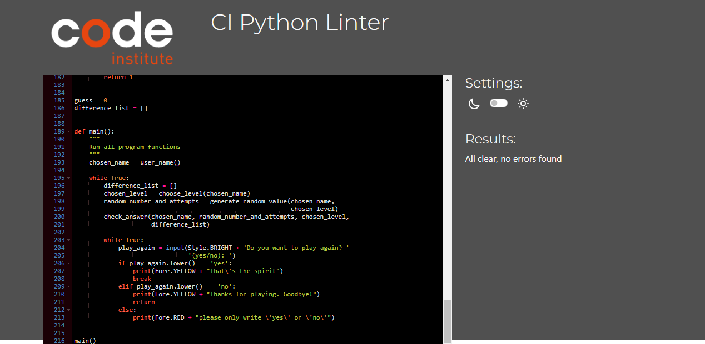

# Guess My Number

*Guess My Number* is a python terminal game which runs on a mock terminal in Heroku

[here is the deployed version of it](https://guess-my-number-jpd-5867ef6aed06.herokuapp.com/)

## How To Play

*Guess My Number* is a fun one-player game vs the computer where the computer randomly selects a number and the user attempts to guess it correctly.  The random number is given parameters from which to choose the random number from depending on the difficulty selected by the user. The amount of attempts can also vary and also depends on the difficulty chosen.  between attempts, the user is given feedback to notify if they're getting closer to or further from the target number.  in addition to this, there are also a set of clues given once user only finds they have 3 attempts left (as seen in the [features section below](#features)). It is run on a loop for user to choose to play again if they wish, otherwise selecting 'no' would break the loop and end the game.

### My GitHub Repository

You can visit the GitHub Repository [here](https://github.com/JonathanDussot/guess-my-number)

## CONTENTS

- [Star Wars Quiz](#star-wars-quiz)
  - [How To Play](#how-to-play)
    - [My GitHub Repository](#my-github-repository)
  - [CONTENTS](#contents)
  - [Intelligent Diagramming chart](#intelligent-diagramming-chart)
  - [Features](#features)
    - [Existing Features](#existing-features)
    - [Future Implementations](#future-implementations)
    [Technologies Used](#technologies-used)
    - [Libraries and Programs Used](#libraries-and-programs-used)
  - [Deployment And Local Development](#deployment-and-local-development)
    - [Deployment to GitHub pages](#deployment-to-github-pages)
    - [Local Deployment](#local-deployment)
      - [How to Fork](#how-to-fork)
      - [How to Clone](#how-to-clone)
  - [Testing](#testing)
  - [Credits](#credits)
    - [Content](#content)
    - [Media](#media)
  - [Acknowledgements](#acknowledgements)

## Intelligent Diagramming chart

I created this Intelligent Diagram using Lucid Chart

## Features

### Existing Features

- Name requested from user
- Instructions to the game given before then requesting game difficulty

- Errors generated upon entering invalid characters/information.

- Keeps a record of previous guesses and calculates difference between the last two to indicate if user is getting closer or further.
- Approximity function informs user when they are quite close to the target number.

- Clues are given upon determining the user has only 3 attempts left.  These clues are generated from an *if* statement that calculated if the target number is divisible by 3 or 4.

- A message is displayed at the end to state that user got the number correct.
- An alternative to this is the game over message should the user run out of attempts.
- In both cases, the user is then given the option to restart the game and re-select the difficulty.

### Future Implementations

ideas for future implementations I would like to include are:

1. A Multi-player option where users take turns to see who finds the number first.
2. A variety of other clues given especially at higher difficulties so users can put their math skills to the test.
  
## Technologies Used

### Libraries and Programs Used

[GitHub](https://github.com/) to save and store my website.

[Gitpod](https://www.gitpod.io/) IDE I used for this project.

[Lucidchart](https://www.lucidchart.com/pages/) to create intelligent diagramming chart.

Colorama - library I used to apply different colours and styles to my text.

[Heroku](https://dashboard.heroku.com/) to deploy my project on the terminal.

## Deployment And Local Development

### Deployment to Heroku

The site is deployed using Code Institute's mock terminal for Heroku. To deploy:

1. Create or log into your account on heroku.com.
2. Create a new app, which will take you to add a name, choose your region and click on 'create'.
3. Go to the 'Settings' tab.
4. Scroll down to the 'Config Vars' option and add the key 'PORT' and value '8000'.
5. Select and add buildpacks.  This project required python first and and then nodejs.
6. Go to the 'Deploy' tab and select 'GitHub' as 'Deployment method'.
7. Enter and search for your repository using the name given to connect.
8. You are then given options to either automatically or manually deploy, depending on your preference.

### Local Deployment

#### How to Fork

1. Copy the link to this repository.
2. Log in or sign up to your GitHub account and click on the **Fork** button on the top-right corner.
3. You should now have a copy included in your account.

#### How to Clone

1. Copy the link to this repository.
2. Log in or sign up to your GitHub account and click on the **Code** button.
3. You are given to option to clone using HTTPS or GitHub CLI and copy the link.

## Testing

### Validator

I used [Code Institute's pep8 Validator](https://pep8ci.herokuapp.com/) to verify there were no errors by the end after having addressed all the warnings.

### Manual Testing

### Functionality tests

#### Button Testing

- Tho code passed through [pep8ci](https://pep8ci.herokuapp.com/) and returned without any errors or warnings.

| Items being tested | Actions taken to test | Expected result | Outcome |
|---|---|---|---|
|User name - invalid messages.| Entered numbers and non-alphanumeric characters.| Invalid messages returned. | :white_check_mark: |
|Choose level - invalid messages| Entered wrong options.| Invalid messages returned.| :white_check_mark: |
|Choose level - lower()method.| Entered correct options in capital letters. | The code recognizes option and selects level.| :white_check_mark: |
|Generate random value.| Print number to verify it was generated within range. | Should only generate number indicated as per level.| :white_check_mark: |
|Approximity - proximity message.| Compare guess and random number to confirm proximity and message occurrence. | Message displayed correctly when within 9 numbers of range.| :white_check_mark: |
|Approximity - warmer/colder message.| Verify proximity with difference list-appended values | Messages displayed correctly when at least 2 numbers appended and compared.| :white_check_mark: |
|Check answer - invalid messages.| Entered non-numeric characters, number out of given range, and duplicated numbers | Messages correctly display indicating specific error and how to proceed.| :white_check_mark: |
|Check answer - Clues.| Using up attempts until 3 left, check number is divisible. | Clues should only appear if there are 3 attempts left, divisibility correctly calculated.| :white_check_mark: |
|Play again feature.| Entered yes/no to verify outcome + other words. | Invalid message displayed unless 'yes'/'no' selected, flow proceeds correctly after option selected.| :white_check_mark: |

### Bugs Solved

- Upon attempting to create my *difference list* to calculate if user was getting closer or further, i received a **IndexError: List index out of range**. To fix this, I nested my code to calculate the last two guesses within another if statement that only activated once the list had a length of at least two items.

- I added the .lower() method to my choose_level function and it was identifying the level of difficulty chosen as per the confirmation print message, but the game wasn't starting and gave an invalid message instead.  I noticed the invalid message was from my generate_random_value function and that it didn't recognize the capital characters, so I also apply the .lower() there and fixed the bug.

- Importing colorama worked on my local terminal but not the deployed terminal in Heroku.  Websites didn't have information as to why this was happening, so I checked and found the solution on slack to 'pip3 freeze > requirements.txt'.

### Remaining Bugs

- None that I'm aware of.

## Credits

### Content

- The information I got for my questions mostly came from [buzzfeed](https://www.buzzfeed.com/laurafrustaci/star-wars-trivia)

- Some concepts and parts of code were taken from a [tutorial by 'Web Dev Simplified'](https://www.youtube.com/watch?v=riDzcEQbX6k) as detailed in my [script.js](script.js).

- [Stackoverflow](https://stackoverflow.com/questions/9419263/how-to-play-audio) and their ideas of how to implement audios and counters

## Acknowledgements

I would like to acknowledge the following people who have been a huge help for this project:

- [Lauren-Nicole](https://github.com/CluelessBiker) - My Code Institute Mentor for her advice and expertise.

- The Slack community of Code Institute for their help and support.

- Tutor Support from Code Institute for their help and support.